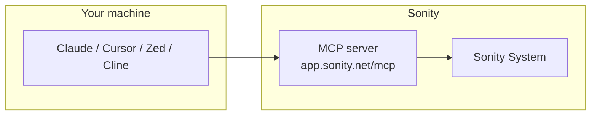

# Introduction to the Sonity MCP server

Estimated reading time: 4 minutes.

The **Model Context Protocol (MCP)** is an open standard that lets AI assistants talk to external tools. Think of it as "a USB-C plug for AI": instead of every AI app building its own integration with every SaaS tool, MCP defines one common way for an AI client to discover and call tools exposed by a server.

Sonity ships an **MCP server** so you can point an AI client — Claude Desktop, Cursor, Zed, Cline, or any MCP-compatible app — at your Sonity account and let the AI drive your outreach: list profiles, build campaigns, run search-and-collect, attach leads, and pull metrics, all through natural-language requests.

## Why Sonity built an MCP server

Before MCP, getting an AI to act on your Sonity data meant either hand-pasting information into a chat window or writing bespoke integrations per client. With the Sonity MCP server:

- **No copy-paste.** The AI reads your campaigns, leads, and profiles directly.
- **One integration, many clients.** Any MCP-compatible app can connect with the same URL + token.
- **Scoped, revocable access.** You authorize the server with a short-lived, scoped token from inside Sonity — nothing is ever permanently handed out.

## What you need

1. A **Sonity account** with at least one profile.
2. A supported **MCP client** (see table below).
3. A **Sonity authorization token**, generated from the in-app MCP dialog. See [Authentication](./authentication).

## How it fits together

1. Your AI client sends a JSON-RPC request to the MCP server with your Bearer token.
2. The MCP server verifies the token, translates the request into a Sonity GraphQL query (or a driver call for `direct_search_and_collect`), and signs it as HS256 before forwarding it.
3. The GraphQL API / driver performs the action against your Sonity data and returns the result.
4. The MCP server hands the result back to the AI client as plain text.

## Supported clients

Any client that implements the MCP spec works. The ones we test against:

| Client | Transport | Notes |
| --- | --- | --- |
| **Claude Desktop** | HTTP | Native MCP support. |
| **Cursor** | HTTP | Configured via `~/.cursor/mcp.json`. |
| **Zed** | HTTP | Configured via Zed settings. |
| **Cline** | HTTP | Configured via `cline_mcp_settings.json`. |
| **Custom scripts** | HTTP or stdio | Use the official `@modelcontextprotocol/sdk` or raw JSON-RPC. See [Connecting](./connecting). |

## What the server can and cannot do

**Can**

- List your Sonity profiles and resolve a `sonity_profile_id`.
- List, create, and update campaign definitions.
- Add or update campaign steps (your outreach sequence).
- Run search-and-collect jobs (with or without an existing campaign).
- Attach collected leads to a campaign.
- Fetch campaign metrics (TCP summary + meeting metrics).
- Send one-off messages to a specific lead.

**Cannot**

- Send LinkedIn messages outside of a campaign step or the `messaging_send` tool.*
- Bypass LinkedIn's daily limits. All LinkedIn-side actions still go through Sonity's normal rate-limited execution pipeline.
- Modify your Sonity account billing, users, or passwords. Those are admin-only and not exposed via MCP.
- 
:::tip
We are working towards supporting the ability to send message over MCP, even outside of a campaigns
:::

:::tip
The full tool reference, including required arguments and which scopes each needs, is in [MCP tools](./tools).
:::

## Where to next

- [Authentication](./authentication) — how to get a token and how the server verifies it.
- [Connecting a client](./connecting) — copy-paste config for Claude, Cursor, Zed, Cline, and raw cURL.
- [MCP tools](./tools) — every tool the server exposes, with arguments.
- [Troubleshooting](./troubleshooting) — common errors and how to fix them.