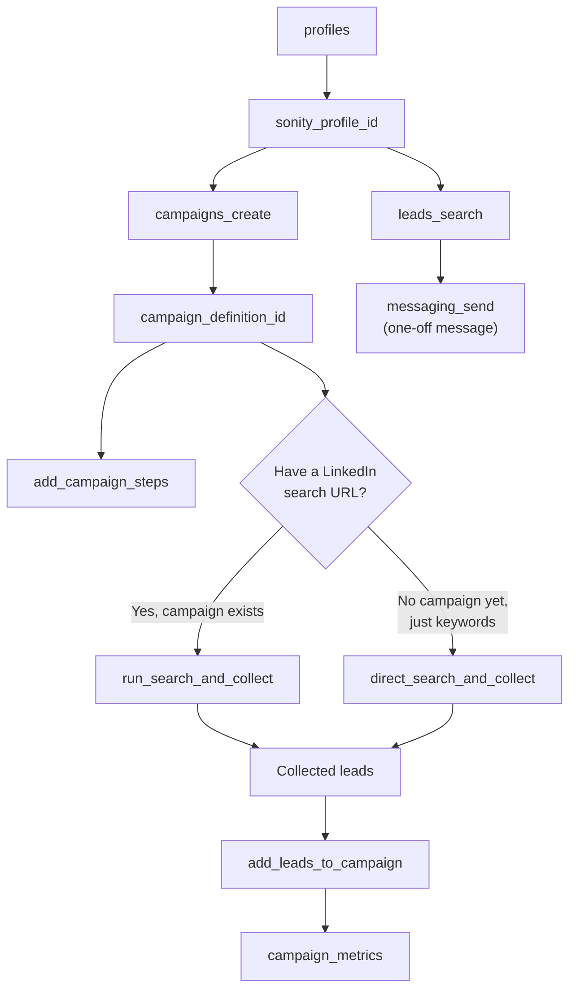

# Sonity MCP tools

Estimated reading time: 6 minutes.

The Sonity MCP server exposes 11 tools. Every tool call is a JSON-RPC `tools/call` request with `name` and `arguments`, and returns a single text block (usually JSON) you can read or parse.

## Tool reference

| Tool | Purpose | Required arguments | Needs `mcp:write`? |
| --- | --- | --- | --- |
| [`profiles`](#profiles) | List your Sonity profiles; resolve a `sonity_profile_id`. | — (account derived from JWT) | No |
| [`campaigns_list`](#campaigns_list) | List campaign definitions for a profile. | optional `sonity_profile_id` | No |
| [`campaigns_create`](#campaigns_create) | Create a new campaign definition. | `name`, `sonity_profile_id` | Yes |
| [`campaigns_update`](#campaigns_update) | Update a campaign (rename, pause, activate, etc.). | `id` | Yes |
| [`add_campaign_steps`](#add_campaign_steps) | Bulk upsert message steps on an existing campaign. | `campaign_definition_id`, `values` | Yes |
| [`campaign_metrics`](#campaign_metrics) | Fetch TCP summary + meeting metrics for a campaign. | `campaign_definition_id` | No |
| [`run_search_and_collect`](#run_search_and_collect) | Create a search-and-collect task for an **existing** campaign. | `sonity_profile_id`, `campaign_definition_id`, `url` | Yes |
| [`direct_search_and_collect`](#direct_search_and_collect) | Run search-and-collect directly against the driver, **no campaign needed**. | `sonity_profile_id`, `keywords` | Yes |
| [`add_leads_to_campaign`](#add_leads_to_campaign) | Attach a batch of leads to a campaign. | `campaign_definition_id`, `sonity_profile_id`, `values` | Yes |
| [`leads_search`](#leads_search) | Free-text lead search. | `query` | No |
| [`messaging_send`](#messaging_send) | Send a one-off message to a specific lead. | `leadId`, `text` | Yes |

The `sonity_account_id` you are acting on is read from the JWT `sonity_account_id` claim — you never pass it as an argument.

## Typical workflow

Most non-trivial sessions follow this shape: resolve a profile, create or pick a campaign, add steps, run search-and-collect to find leads, attach them to the campaign, then watch the metrics.



### `profiles`

List all Sonity profiles belonging to your account. Each profile is a connected LinkedIn/CRM identity. **Call this first** to resolve the `sonity_profile_id` that most other tools require.

Arguments: none meaningful. (`sonity_account_id` is taken from the JWT; passing it does nothing.)

### `campaigns_list`

List campaign definitions for a profile. Returns `id`, `name`, `type`, `start_date`, `set_active`, `set_inmail`, and timestamps.

Arguments:

- `sonity_profile_id` (optional) — filter to one profile. Omit to list campaigns across all your profiles.

### `campaigns_create`

Create a new campaign definition. Returns the created campaign including its `id`.

Arguments:

- `name` (required) — campaign name.
- `sonity_profile_id` (required) — profile that owns the campaign (from `profiles`).
- `type` (optional) — one of `Connector`, `SchedulePosts`, `Messenger`, `InMail`. Omit if unsure.
- `extensions` (optional) — `{ requeue_errors?: boolean, requeue_withdrawn?: boolean }`.
- `campaign_messages` (optional) — initial sequence of message steps to create with the campaign. See [The `{variable}` fallback rule](#the-variable-fallback-rule) below.
- `auto_fallback` (optional) — see below.

### `campaigns_update`

Update fields of an existing campaign. Only pass the fields you want to change.

Arguments:

- `id` (required) — campaign definition id (from `campaigns_list`).
- `name`, `sonity_profile_id`, `start_date`, `set_active`, `set_inmail`, `type`, `extensions` — any subset.

Use this to rename a campaign, activate it (`set_active: true`), pause it (`set_active: false`), enable InMail mode, or reschedule it.

### `add_campaign_steps`

Bulk upsert (insert or update) message steps on an existing campaign. Pass one entry per step; include `id` to update an existing step, or omit it to create a new one. Steps are ordered by the `step` field (0-based).

Arguments:

- `campaign_definition_id` (required).
- `values` (required) — array of step objects, each with `step` (0-based index), `type` (e.g. `Connection Message`, `Welcome Message`), `text`, and optional `delay`, `fallback_text`, `inmail_subject`, `like_post`, `skip_message`, `complete_time`, `extensions`.
- `auto_fallback` (optional) — see below.

### `campaign_metrics`

Fetch performance metrics for a campaign: a TCP (touch/conversion) summary table plus meeting metrics (contacts, requests, connections, replies, errors).

Arguments:

- `campaign_definition_id` (required).
- `sonity_profile_id` (optional) — scope the TCP summary.
- `campaign_definition_names` (optional) — additional name filter for the TCP summary.
- `timeRange` (optional) — `[start, end]` pair of ISO 8601 timestamps.

### `run_search_and_collect`

Create a search-and-collect task attached to an **existing** campaign. Use this when you already have a `campaign_definition_id` and a LinkedIn search URL. The driver visits profiles from that URL and attaches them to the campaign.

Arguments:

- `sonity_profile_id` (required).
- `campaign_definition_id` (required) — the campaign to attach collected leads to.
- `url` (required) — LinkedIn search URL to collect leads from.
- `visit_max` (optional, default `150`) — max profile visits.

### `direct_search_and_collect`

Run a search-and-collect job directly against the driver **without creating a campaign first**. Use this when the user has no `campaign_definition_id` — only keywords. Returns collected lead records you can then pass to `add_leads_to_campaign`.

Arguments:

- `sonity_profile_id` (required).
- `keywords` (required) — search keywords (job title, company, skill, etc.).
- `visit_max` (optional, default `20`) — max profile visits.
- `network_distance` (optional) — array of `1st`, `2nd`, `3rd`.
- `location` (optional) — array of LinkedIn location URNs (e.g. `urn:li:geo:101174742`).

### `add_leads_to_campaign`

Attach a batch of leads to an existing campaign. Each lead is queued into the campaign; Sonity creates a contact and prospect for each and links them to the campaign. Use this after `direct_search_and_collect` (or `run_search_and_collect`) to enroll collected leads for sequenced outreach.

Arguments:

- `campaign_definition_id` (required).
- `sonity_profile_id` (required) — applied to every lead in the batch.
- `values` (required) — array of lead objects. Only `l_id` (the LinkedIn public slug, e.g. `victor-jayeoba-400b96253`) is required per lead; optional fields include `name`, `href`, `title`, `first_name`, `last_name`, `connection_type`, `current_position`, `location`, `description`, `thumb`, `thread_l_id`.

### `leads_search`

Free-text search across your existing Sonity leads by name, company, title, etc. Returns matching leads with their `id` — use that `id` for `messaging_send`.

Arguments:

- `query` (required) — free-text search.
- `limit` (optional, default `20`, max `100`) — max results.

### `messaging_send`

Send a single one-off message to a specific lead. For multi-step sequenced outreach to many leads, build a campaign with `campaigns_create` + `add_campaign_steps` instead.

Arguments:

- `leadId` (required) — Sonity lead id (from `leads_search`).
- `text` (required) — body text of the message.

## The `{variable}` fallback rule

When you create or update campaign steps with `campaigns_create` or `add_campaign_steps`, any step whose `text` contains personalization variables like `{name}`, `{company}`, or `{title}` **must** also supply a `fallback_text`. If it doesn't, the call throws:

```
Step 0 ("Connection Message") references variables {name}, {company} but has no fallback_text.
Either provide a fallback_text on the step, or pass auto_fallback: true to use generic
replacements (e.g. {name}→"there", {company}→"your company").
```

This protects you from sending literally `{name}` to a lead whose first name is missing.

### Two ways to satisfy the rule

1. **Supply `fallback_text` per step** — a safe generic version of the message. Recommended for high-stakes first-touch steps.
2. **Pass `auto_fallback: true`** — the server replaces each variable with a generic placeholder:
   - `{name}`, `{first_name}`, `{full_name}` → `there`
   - `{company}`, `{company_name}`, `{employer}` → `your company`
   - `{title}`, `{job_title}`, `{position}`, `{role}` → `your role`
   - `{industry}`, `{sector}` → `your industry`
   - `{location}`, `{city}`, `{country}`, `{region}` → `your area` / `your country` / `your region`
   - `{school}`, `{university}`, `{college}` → `your school`
   - any unknown variable → `there`

See also [Personalization variables and merge tags](../using_sonity/personalization_variables) for the broader variables story in Sonity.

## Where to next

- [Troubleshooting](./troubleshooting) — common tool-call errors.
- [Connecting a client](./connecting) — if you haven't wired up a client yet.